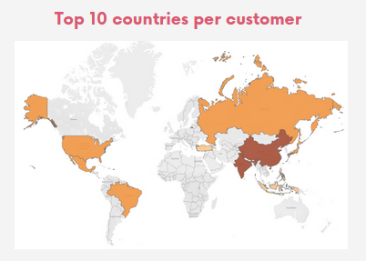
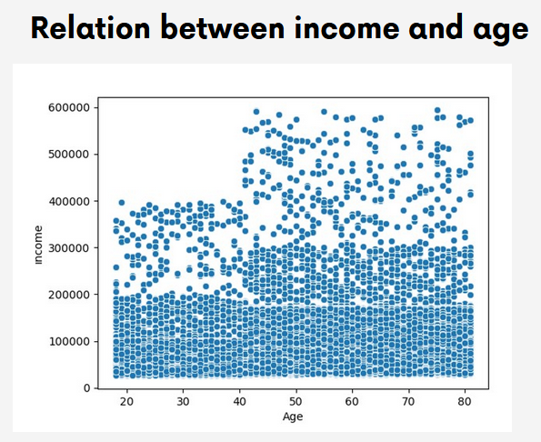
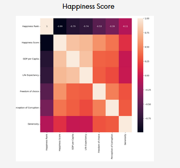
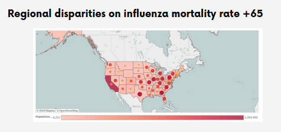

# Nerea Menor's Portfolio

Welcome to my portfolio! Here you can find my work as a journalist, marketing manager, and data analyst.

## Table of Contents

- [Professional Summary](#professional-summary)
- [My Projects](#my-projects)
  - [Data Analysis Projects](#data-analysis-projects)
  - [Journalism](#journalism)
  - [Localized & Original Content](#localized--original-content)
- [CV](#cv)

## Professional Summary

Experienced journalist and marketing manager with hands-on experience as a marketing analyst, now turned data analyst. Adept at leveraging storytelling and strategic communication to boost engagement and campaign effectiveness. Proven track record in coordinating editorial workflows and managing multifunctional teams for seamless project execution and collaboration.

## My Projects

### Data Analysis Projects

Here are some of the data analysis projects I’ve worked on:

- [Film Streaming - SQL](https://github.com/NereaMe/launchstrategy_SQL)  
  Assisted in launching an online video service, focusing on data processing and enhancing customer insights.  
  

- [Ecommerce - PYTHON](https://github.com/NereaMe/Ecommerce_python/)  
  Conducted data analysis for Instacart, focusing on customer segmentation to improve marketing strategies.  
  

- [Happiness Score - PYTHON](https://github.com/NereaMe/HappinessScore_python)  
  Performed exploratory analysis on happiness indicators using Python and Tableau for policy-making insights.  
  

- [Health - TABLEAU](https://github.com/NereaMe/health_tableau)  
  Analyzed influenza trends to help a medical staffing agency plan for peak seasons and staffing needs.  
  

### Journalism

A selection of my journalistic work, specializing in topics like arts, social issues, and culture.

- **Eduardo Chillida: Profound is the air – 100 years of emptiness**  
  Coverage of contemporary art in *Voci dell'opera* magazine.  
  

- **Niñas veneradas como diosas**  
  Article discussing social and environmental challenges in *Ethic* magazine.  
  

- **Andy Warhol, como nunca lo habías visto**  
  Coverage of an art exhibition in *El Confidencial's* magazine dedicated to art, design, and architecture.  
  

More Journalism Works

- **The Power of Art in Society**  
  Exploration of art's impact on social change in *Artistry Today*.  
  

- **Gender Equality in the Arts**  
  Article addressing gender issues in the art world, published in *Culture Review*.  
  

### Localized & Original Content

Writing and content localization, including infographics and PR articles, focused on technology and lifestyle.

- **Click to Buy Infographic**  
  Study on European online shopping habits (2019 edition).  
  

- **120 Years of the Olympics Through Tennis Fashion**  
  Evolution of tennis fashion through the figure of Serena Williams in *La Vanguardia*.  
  

- **Learn to Decorate with Wallpaper**  
  Lifestyle blog post on home decor.  
  

More Localized & Original Content

- **The Powers of Plants**  
  Pinterest post on indoor plant guide.  
  

- **How We Shop Online: Devices and Trends**  
  Study on European habits regarding online shopping devices.  
  

## Feel free to explore my [repositories](https://github.com/NereaMe) to see more of my work.

## CV

### Work Experience

**Journalist and Author**  
*Various Locations* | *2011 - 2024*  
- Covered complex topics such as art, human rights, and gender issues in diverse cultural contexts.

**CRM Manager**  
*Ladenzeile GmbH* | *Berlin* | *2021 - 2023*  
- Managed cross-departmental projects to optimize engagement and conversion.

**SEO Manager, PR and Data**  
*Visual Meta GmbH* | *Berlin* | *2018 - 2021*  
- Coordinated cross-departmental organic marketing efforts.

### Skills & Tools

- **Design:** Figma, Canva, InDesign, HTML
- **Analytics:** Python, SQL, Excel, Tableau

### Education

**Data Analyti
